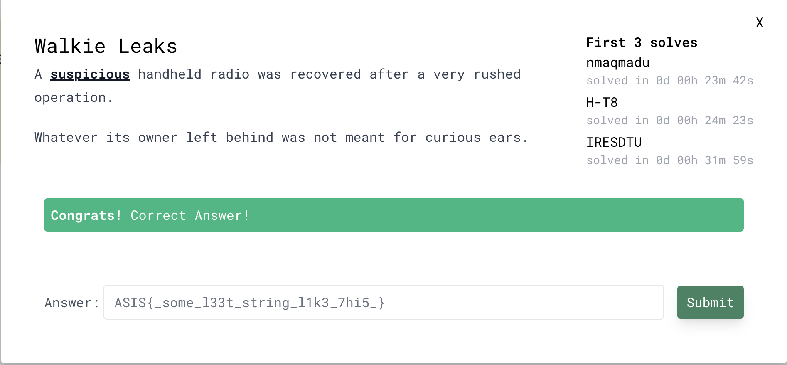

# Walkie Leaks — write-up

## Kết quả

```text
ASIS{u5b_p4ck3t5_n3v3r_l1e}
```

Solver chỉ dùng Python standard library:

```bash
python3 solution/solve.py
```

Hoặc truyền đường dẫn capture khác:

```bash
python3 solution/solve.py Capture.pcapng
```

Output trên file của đề:

```text
[+] transactions: 210
[+] decoded blocks: 180 (178099 bytes)
[+] flag block: transaction 165, address 0x00062400, offset 0x0010
[+] fragments: ASIS{ | u5b_ | p4ck | 3t5_ | n3v3 | r_l1 | e}
[+] FLAG: ASIS{u5b_p4ck3t5_n3v3r_l1e}
```

## 1. Phân tích `image.png`

Ảnh cho thấy một bộ đàm mang nhãn Motorola GT10, với hai tần số
`400.22500` và `450.35000` trên màn hình. Kiểm tra cấu trúc PNG, metadata,
dữ liệu nối sau `IEND`, alpha channel và các bit-plane thông dụng không cho
thấy payload steganography hữu ích.

Vì vậy, vai trò chính của ảnh là giúp nhận diện phần cứng. Dòng GT-10 này là
thiết bị OEM có các rebrand tương thích như Zastone M10 và Radtel RT-752. Hai
tần số trên màn hình không phải khóa AES.

SHA-256 của file đã phân tích:

```text
0546b5eeb33f049b8128024481575d33d4503b11e808b1ab52b88eddfb86051e  image.png
```

## 2. Nhận diện traffic trong `Capture.pcapng`

Capture có link type `USBPcap` (DLT 249). USB descriptor cho thấy thiết bị
`VID:PID 1a86:7523`, tức chip USB-to-serial CH340. Phần dữ liệu cần quan tâm
nằm trên hai bulk endpoint:

- `0x02`: host gửi lệnh đến radio.
- `0x82`: radio trả dữ liệu về host.

Trong Wireshark có thể lọc bằng:

```text
usb.endpoint_address == 0x02 || usb.endpoint_address == 0x82
```

Payload trông gần như ngẫu nhiên, nhưng độ dài cho thấy cấu trúc lặp lại:

- 25 lệnh khởi tạo, mỗi lệnh 7 byte.
- Các lệnh đọc bộ nhớ dài 17 byte.
- Mỗi response đọc thường mang khoảng 1024 byte dữ liệu.

SHA-256 của capture:

```text
f9c5cca0b4755861a4e51669ad777f02b687334274c94723f4824903e2d7dd4f  Capture.pcapng
```

## 3. Tìm đúng giao thức

CHIRP có một driver công khai cho
[Radtel RT-752](https://github.com/EA5JQP/Chirp-Driver-Radtel-RT752/blob/main/rt752.py).
Driver chứa đúng các command và lớp obfuscation xuất hiện trong capture:

```text
CMD_INIT_RADIO = 5A335796ACBB
CMD_READ_RADIO = 5A46998A6BA7
```

Lớp ngoài sử dụng byte đầu tiên làm seed. Với ciphertext `c`, byte plaintext
thứ `i` được tính như sau:

```python
p[i] = (c[i + 1] - SecretRandom[(c[0] + i) & 0xff]) & 0xff
```

Sau khi bỏ lớp ngoài, response đọc bộ nhớ có cấu trúc quan trọng:

|           Offset | Nội dung                   |
| ---------------: | -------------------------- |
|     `0x00..0x05` | Magic/command              |
|     `0x06..0x09` | Địa chỉ bộ nhớ, big-endian |
|     `0x0a..0x0b` | Độ dài dữ liệu, big-endian |
|         `0x0c..` | Payload còn bị mã hóa      |
| ngay sau payload | Seed của lớp dữ liệu       |
|    cuối response | Checksum 4 byte            |

Payload được giải bằng hai bảng `SecretRandom` và `SecretCodeData`:

```python
secret = SecretCodeData[seed]
plain[j] = SecretCodeData[
    (encrypted[j] - SecretRandom[j % 256] + secret) % 256
]
```

`solve.py` nhúng hai bảng từ driver, tự parse các Enhanced Packet Block của
pcapng, bỏ USBPcap pseudo-header, gom các fragment IN theo từng request OUT,
kiểm tra checksum rồi giải cả hai lớp.

## 4. Lấy flag

Transaction 165 đọc 1024 byte từ địa chỉ `0x00062400`. Sau khi giải, flag nằm
từ offset `0x10`, bị chia thành các record 16 byte và padding bằng `FF`:

```text
0x62410: 415349537bffffffffffffffffffffff  ASIS{
0x62420: 7535625fffffffffffffffffffffffff  u5b_
0x62430: 7034636bffffffffffffffffffffffff  p4ck
0x62440: 3374355fffffffffffffffffffffffff  3t5_
0x62450: 6e337633ffffffffffffffffffffffff  n3v3
0x62460: 725f6c31ffffffffffffffffffffffff  r_l1
0x62470: 657dffffffffffffffffffffffffffff  e}
```

Loại padding `FF` và ghép các fragment:

```text
ASIS{u5b_p4ck3t5_n3v3r_l1e}
```



## Tham khảo

- [CHIRP driver cho Radtel RT-752/GT-10](https://github.com/EA5JQP/Chirp-Driver-Radtel-RT752/blob/main/rt752.py)
